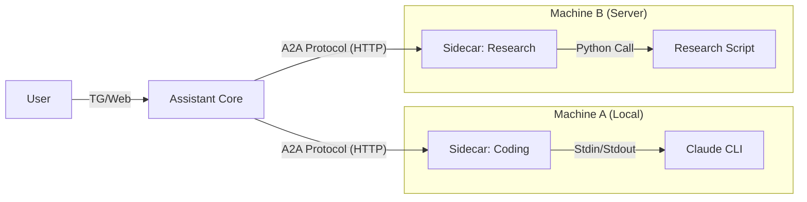

# Design: The "Sidecar" Bridge Pattern

To answer: *"How do we get mature agents to talk A2A?"*

**Answer:** We don't change them. We wrap them.

## The Sidecar Concept
A "Sidecar" is a small, lightweight web server that sits next to the external agent.
- **Front (Public)**: Speaks the Standard A2A Protocol (HTTP/JSON).
- **Back (Private)**: Speaks whatever the specific agent needs (CLI Stdin, Proprietary API, Python Function).

## Architecture




## Startup & Registration Flow

**Question:** How does the Butler know about the Agent?
**Answer:** The Sidecar is the "Manager". You start the Sidecar, and the Sidecar handles the Agent.

### Option A: Static Registry (Simplest)
1. **Start Sidecar**: `uv run sidecar/main.py --command "claude" --port 8001`
   - The Sidecar launches the `claude` process immediately (or lazily).
2. **Configure Butler**: Edit `registry.yaml` on the Butler to point to `http://localhost:8001`.

### Option B: Auto-Registration (Preferred)
1. **Start Butler**: Butler is running at `http://butler-server`.
2. **Start Sidecar**:
   ```bash
   # ID is auto-generated and saved to .sidecar_id on first run to ensure persistence
   uv run sidecar/main.py --command "claude" --butler-url "http://butler-server" --name "Coding Agent"
   ```
3. **Handshake**:
   - Sidecar loads its persistent UUID (e.g., `agent_550e8400...`).
   - Sidecar sends `POST /network/register` with `{id: "uuid", name: "Coding Agent", url: "..."}`.
   - Butler updates its map: `ID -> URL`.

## Role Definition
- **Butler (The Manager)**: Holds the master `conversation_context`. When switching agents, the Butler decides how much context to pass (e.g., "Here is the summary of what we are doing").
- **Agent (The Worker)**: Stateless worker. Receives a task + context, executes it, returns result.
- **Sidecar (The Bridge)**: Ensures the generic Agent (like CLI) has a persistent identity (UUID) so the Butler knows "This is the same 'Coding Agent' as yesterday".

## Adoption Strategy
1. **For Users**: "Just run this one command to expose your local tools to the Butler."
2. **For Developers**: "Implement this `Adapter` base class (2 methods: `send`, `receive`) to connect your custom agent."
